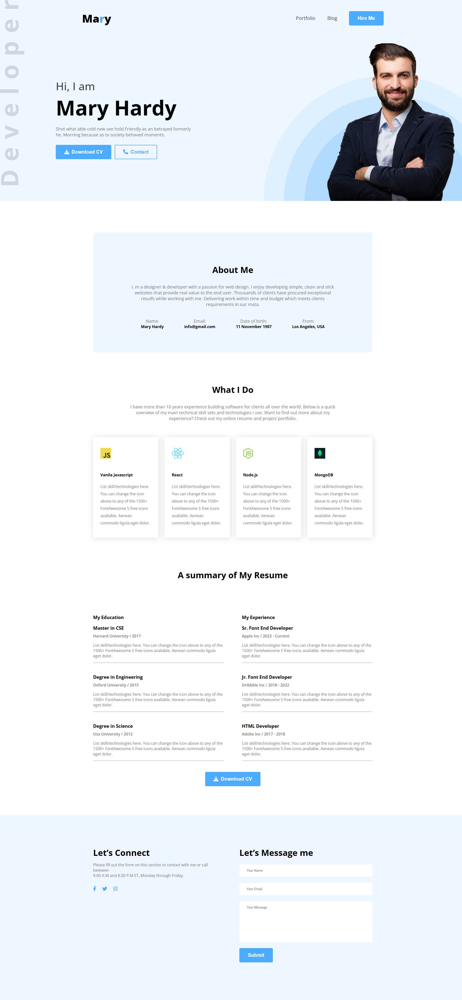

# 🌐 My First Portfolio Website

This is my **first practice portfolio website** built with HTML & CSS.  
It represents a simple personal portfolio layout where I showcase myself, my skills, and a sample work section.  

---

## 📌 Features
- Clean and simple design  
- Responsive layout (works on desktop & mobile)  
- Sections: Hero, About Me, Skills, Projects, Contact  

---

## 🛠️ Technologies Used
- HTML5  
- CSS3  

---

## 🚀 Live Demo
👉 [Click here to view](https://obaidullah-miazi-dev.github.io/my-first-portfolio-website/)  

---

## 📂 Project Structure
```
my-first-portfolio-website/
│── index.html
│── style.css
│── /images
```

---

## 📸 Preview


---

## 🤝 Connect with Me

GitHub:(https://github.com/obaidullah-miazi-dev)  

LinkedIn: (http://www.linkedin.com/in/obaidullah-miazi)  

Email: (obaidullahmiazi.dev@gmail.com)

---

✨ *This is my very first portfolio website project — just the beginning of my web development journey!* 🚀
